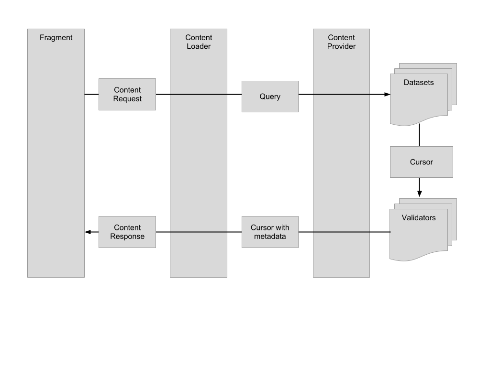
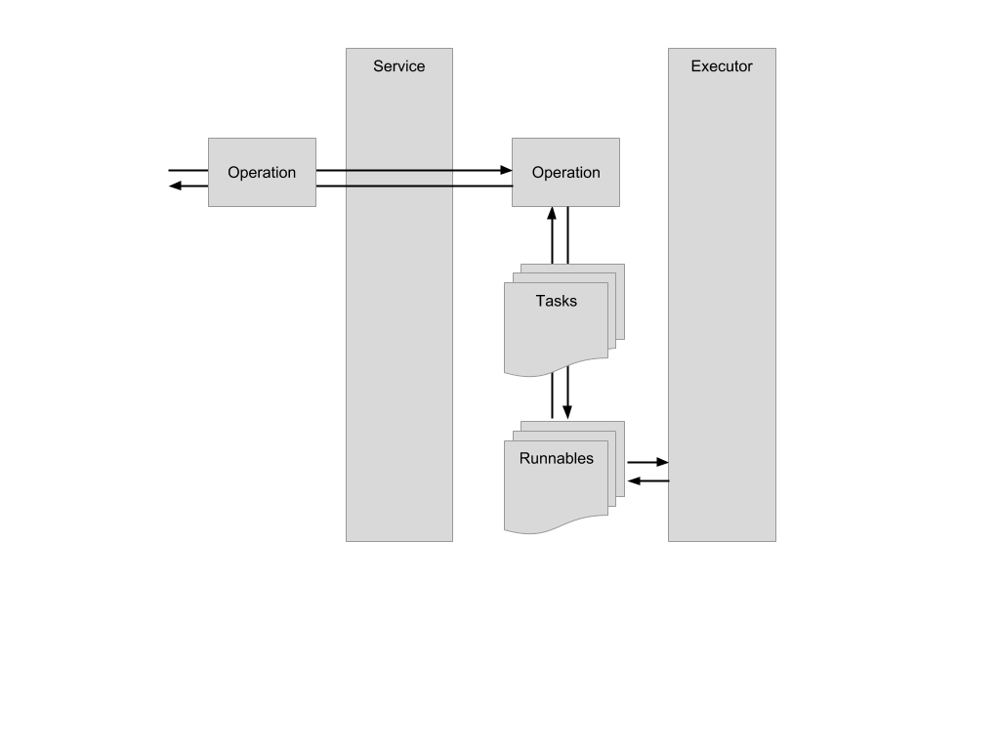

# Xtreme Labs Rest Library

The REST library provides a framework for a data management solution for Android applications. This enables developers to quickly integrate many fundamental features, such as offline functionality, asynchronous requests and database management.

The architecture of REST is based off of Google's recommendations from this Google I/O talk:
http://www.youtube.com/watch?v=xHXn3Kg2IQE


<br />

# XL Rest Overview



# XL Rest Service Overview




<br />

# Preface

The XL Rest Library is a local-first offline store that provides hooks to resolve differences with a remote repository.  

We take all the pieces that Google provides as part of their best practices for building Android Applications and bundle them with our own interface for convenience and ease of implementation.

In order to fully understand the entirety of this library you should familiarize yourself with the following classes and tutorials:


[Content Providers](http://developer.android.com/guide/topics/providers/content-providers.html)

[Loaders](http://developer.android.com/guide/components/loaders.html)

[CursorAdapter](http://developer.android.com/reference/android/widget/CursorAdapter.html)

[Cursor](http://developer.android.com/reference/android/database/Cursor.html)

[Uri](http://developer.android.com/reference/android/net/Uri.html)


<br />

# Fragment

The ContentLoaderFragment is a convenience class for loading data from a ContentProvider. It provides a simple interface which abstracts away most of the lifecycle work when using loaders.

The example below shows how to execute a request for Posts (sorted by Date) and handle the response.

```
@Override
public void onStart() {
	super.onStart();

	final Uri uri = MyAppContentProvider.Uris.POSTS_URI;
	final ContentRequest request = new ContentRequest(uri);
	request.setSortOrder(PostTable.Columns.DATE);

	execute(request);
}

@Override
public final void onLoaderFinished(final ContentResponse response) {
	final ContentState state = response.getContentState();
	final Cursor cursor = response.getCursor();

	// do stuff with the cursor
}

@Override
public final void onLoaderReset() {
	// clean up
}
```

### ContentRequest

A ContentRequest is a model that contains the parameters necessary to perform a query into a ContentProvider. The only required parameter is the Uri.

### ContentResponse

A ContentResponse is a model that contains all the response data from the query. This includes a Cursor, a ContentState and a boolean flag indicating if there is a corresponding network request.


<br />

# ContentLoader

<em>Note: If you are using the ContentLoaderFragment (or one of its derived classes) you don’t need to worry about how ContentLoaders work.</em>

A ContentLoader takes a ContenRequest from the ContentLoaderFragment and transforms it into a query that can be performed on the ContentProvider. It has two interfaces of interest.

The ContentLoader interface:

```
public interface ContentLoader {
	public void execute(ContentRequest request);
	public void cancel();
	public void destroy();
}
```

The ContentLoaderListener interface:

```
	public interface ContentLoaderListener {
	public void onLoaderFinished(ContentResponse response);
	public void onLoaderReset();
}
```

Behind the scenes the ContentLoader uses a custom implementation of the Android CursorLoader class to handle fetching the data in the background.


<br />

# ContentProvider

ContentProviders are used to store and retrieve data through a typical CRUD interface. Within the RestContentProvider we persist data using SQLite. 

Our implementation uses a single ContentProvider and delegates work to various Datasets that each handle a single type of data.

```
public class MyAppContentProvider extends RestContentProvider {

  public static final String AUTHORITY = "com.mycompany.app.providers.MyAppContentProvider";
      
  public static final class Uris {
      public static final Uri POSTS_URI = Uri.parse("content://" + AUTHORITY + "/" + Paths.POSTS);
      public static final Uri USERS_URI = Uri.parse("content://" + AUTHORITY + "/" + Paths.USERS);
  }
      
  protected static final class Paths {
      public static final String POSTS = "posts";
      public static final String USERS = "users";
  }
  
  @Override
  public boolean onCreate() {
      registerDataset(AUTHORITY, Paths.POSTS, PostTable.class, PostListValidator.class);
      registerDataset(AUTHORITY, Paths.POSTS + "/*", PostTable.class, PostValidator.class);
      registerDataset(AUTHORITY, Paths.USERS, UserTable.class, UserListValidator.class);
      registerDataset(AUTHORITY, Paths.USERS + "/*", UserTable.class, UserValidator.class);
      return true;
  }
}
```


Within the ContentProvider, any calls to **query**, **update**, **delete**, **insert**, or **bulkInsert** will be forwarded on to the corresponding Dataset that has been registered for that particular Uri.

Here’s the implementation for the delete method in RestContentProvider. You can see that all it does is proxy the delete request to the Dataset.

```
@Override
public int delete(final Uri uri, final String selection, final String[] selectionArgs) {
	final Dataset dataset = getDatasetOrThrowException(uri);
	final int numRowsDeleted = dataset.delete(getDatabase(), uri, selection, selectionArgs);
	return numRowsDeleted;
}
```

<br />

# Datasets

After the request has been filtered through the ContentProvider, a Dataset will handle the requested action. 

Following the delete example above, if a resource identifier has been added to the Uri, we remove that single resource, otherwise we delete all resources of that type.

```
@Override
public int delete(final SQLiteDatabase database, final Uri uri, final String selection, final String[] selectionArgs) {
	if (uri.getPathSegments().size() > 1) { 
		final String id = uri.getLastPathSegment();
		final String selectionWithId = StringUtils.append(selection, Columns.ID + "=?", " AND ");
		final String[] selectionArgsWithId = ArrayUtils.append(selectionArgs, new String[] { id });
		return super.delete(database, uri, selectionWithId, selectionArgsWithId);
	} else {
		return super.delete(database, uri, selection, selectionArgs);
	}
}
```

The corresponding super call simply calls delete on the database with the appropriate table name and selection args.

<br />

# Validators
---

After data has been retrieved by the Dataset and return to the ContentProvider, before passing it back to the requester, we pass that data through a DatasetValidator. The purpose of the validator is to give the developer a chance to report back the ContentState of the data and determine appropriate actions. It also provides a hook to request data from the remote store depending on the the ContentState.

```
public interface DatasetValidator {
	public ContentState validate(Uri uri, Cursor cursor);
	public boolean fetchData(Context context, Uri uri, Cursor cursor);
}
```

The ContentState can be one of the following:

```
public enum ContentState {
	VALID, INVALID, EXPIRED
}
```

**VALID** indicates that the data should be returned to the requester. It is up to date and we do not need to make a request to our remote store to fetch new data.

**INVALID** indicates the data is should not be returned to the requester. We will perform a fetch to our remote store. Once we have new data, our requester is notified and they may request this new data.

**EXPIRED** indicates that the data should be returned to the requester in the interim, but we are still going to fetch data from our remote store. Once we have new data, our requester is notified and they may request this new data.

<br />

# Service

The RestService accepts Operations through its static interface. It checks its cache to make sure the Operation wasn’t recently executed and starts itself. It runs as long as there are Operations running and stops itself once the last one is done.

 Note: This class must be declared in the AndroidManifest.xml file as follows:

```
<service android:name="com.xtreme.rest.service.RestService" android:exported="false" />
```


Service interface to start Operations:

```
public static boolean start(final Context context, final Operation operation);
```


Example of the Service onStartCommand implementation:

```
@Override
public int onStartCommand(final Intent intent, final int flags, final int startId) {
	final int start = super.onStartCommand(intent, flags, startId);
	if (intent != null && intent.hasExtra(Extras.OPERATION)) {
		final Operation operation = intent.getParcelableExtra(Extras.OPERATION);
		handleStart(operation);
	}
	return start;
}

private void handleStart(final Operation operation) {
	operation.setContext(getApplicationContext());
	operation.setPrioritizableHandler(mExecutor);
	operation.setOperationObserver(mHandler);
	operation.execute();
}
```

<br />

# Operation

An Operation is responsible for a collection of Tasks that, when executed, update the data associated with a certain Uri. When started via the RestService, an Operation's Tasks begin executing. Dependencies can be set up between tasks in onCreateTasks(). 

When the final Task finishes executing, the Operation itself is considered finished and one of the following abstract methods is called:

```
public abstract void onSuccess(Context context, List<Task<?>> completed);
public abstract void onFailure(Context context, ServiceError error);
```

<br />

# Task

A Task consists of two components: a networking component, and a processing component. It is considered complete when both of those components have finished executing.

### Network Component

```
public abstract T onExecuteNetworkRequest(Context context) throws Exception;
```

This method is meant to execute network-dependent code (or anything that yields its Thread frequently and is light on the CPU). For example, this is where your model would be downloaded and parsed from the API. All network processing must happen synchronously within this method.

### Processing Component

```
public abstract void onExecuteProcessingRequest(Context context, T data) throws Exception;
```

This method is meant to execute CPU-intensive processing requests. For example, this is where one would insert data into a ContentProvider (backed by a SQLiteDatabase) via the ContentResolver. All processing must happen synchronously within this method.

### RequestIdentifier

```
public abstract RequestIdentifier<?> onCreateIdentifier();
```

This method must return a globally unique RequestIdentifier. This is used within the AuxiliaryExecutor and ensures that if more than one Task is processing the same data, only one actually executes. The results are then shared among all Operations waiting on that Task.
